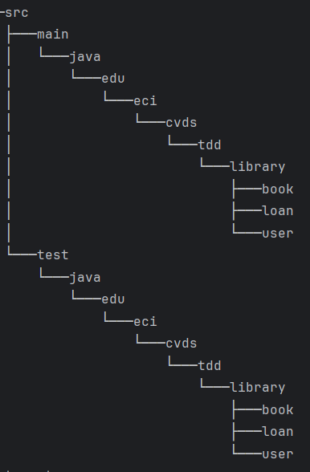
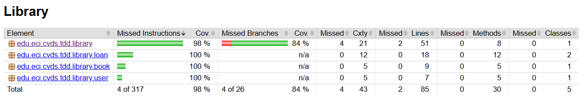
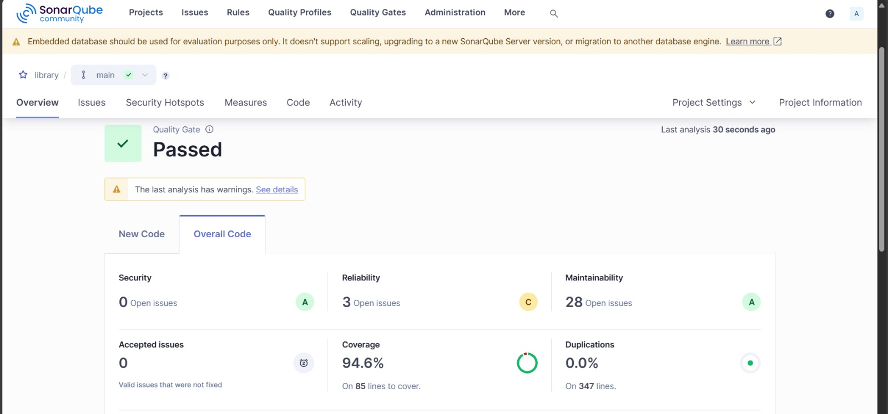

## INTEGRANTES
- Sebastian Galvis Briceño
- Julian Santiago Cardenas 

<<<<<<< HEAD


=======
## Creación del proyecto

Empezamos creando un proyecto maven con los siguientes parámetros:
```xml
Grupo: edu.eci.cvds 
Artefacto: Library 
Paquete: edu.eci.cvds.tdd 
archetypeArtifactId: maven-archetype-quickstart 
```
Dado que íbamos a trabajar con TDD, sería necesario implementar JUnit desde el inicio y preparar la versión de Java a usar
```xml
<properties>
    <maven.compiler.target>17</maven.compiler.target>
    <maven.compiler.source>17</maven.compiler.source>
</properties>
```
```xml
<dependency>
    <groupId>org.junit.jupiter</groupId>
    <artifactId>junit-jupiter-api</artifactId>
    <version>5.11.4</version>
    <scope>test</scope>
</dependency>
```

## El esqueleto del proyecto y sus clases
Con jUnit listo, empezamos a configurar el esqueleto del proyecto tal y como se solicita


Posteriormente, creamos las clases _Book.java_, _Loan.java_, _LoanStatus.java_, _User.java_ y _Library.java_, con el contenido especificado en el laboratorio, junto a sus respectivas clases espejo en el paquete de pruebas.

## Pruebas unitarias y TDD
Con las clases creadas como el laboratorio las pedía, empezamos asegurándonos que los pocos métodos que venían desarrollados en el laboratorio fueran probados y tuvieran su respectiva cobertura.

Posteriormente, desarrollamos las pruebas que validarían el funcionamiento de los métodos de la clase Library una vez estuviera implementada, esto nos permitió saber qué comportamiento deseábamos que tuviera el programa en diferentes situaciones y nos hizo mucho más sencillo el proceso de implementación.

Mediante Jacoco, logramos validar que el cubrimiento fuera satisfactorio:
```xml
<plugin>
    <groupId>org.jacoco</groupId>
    <artifactId>jacoco-maven-plugin</artifactId>
    <version>0.8.12</version>
    <executions>
        <execution>
            <goals>
                <goal>prepare-agent</goal>
            </goals>
        </execution>
        <execution>
            <id>report</id>
            <phase>test</phase>
            <goals>
                <goal>report</goal>
            </goals>
            <configuration>
                <excludes>
                    <exclude>/configurators/</exclude>
                </excludes>
            </configuration>
        </execution>
        <execution>
            <id>jacoco-check</id>
            <goals>
                <goal>check</goal>
            </goals>
            <configuration>
                <rules>
                    <rule>
                        <element>PACKAGE</element>
                        <limits>
                            <limit>
                                <counter>CLASS</counter>
                                <value>COVEREDRATIO</value>
                                <minimum>0.85</minimum><!--Porcentaje mínimo de cubrimiento para construir el proyecto-->
                            </limit>
                        </limits>
                    </rule>
                </rules>
            </configuration>
        </execution>
    </executions>
</plugin>
```


### Agregar Clases

Para este punto creamos las diferentes clases  los directorios como se solicita.
Inicialmente, se realizan las pruebas unitarias para tener cobertura de las clases brindadas. Luego de esto con base
en las descripciones brindades se realizan pruebas unitrais y posteriormente la implementacion de los metodos
de la clase library como se evidencia dentro del codigo.
Finalmente, luego de las pruebas unitarias y las implementaciones correspondientes se logro cubrir la cobertura solicitada.


Cobertura de las pruebas

### SONARQUBE

Agregamos los siguientes codigos al pom.xml como se nos indica, con el fin de añadir SonarQube.
```xml
<plugin>
    <groupId>org.sonarsource.scanner.maven</groupId>
    <artifactId>sonar-maven-plugin</artifactId>
    <version>4.0.0.4121</version>
</plugin>
```

Propiedades de SonarQube y Jacoco

```xml
    <sonar.projectKey>library</sonar.projectKey>
    <sonar.projectName>library</sonar.projectName>
    <sonar.host.url>http://localhost:9000</sonar.host.url>
    <sonar.coverage.jacoco.xmlReportPaths>target/site/jacoco/jacoco.xml</sonar.coverage.jacoco.xmlReportPaths>
    <sonar.coverage.exclusions>src//configurators/*</sonar.coverage.exclusions>
```
Luego de seguir los pasos estipulados en el laboratorio realizamos el proceso usando SonarQube para obtener el siguiente resultado:



